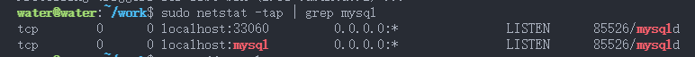
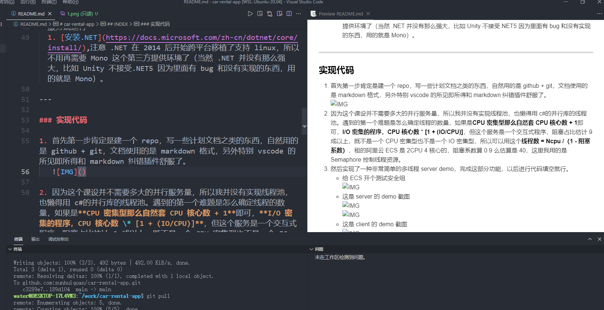
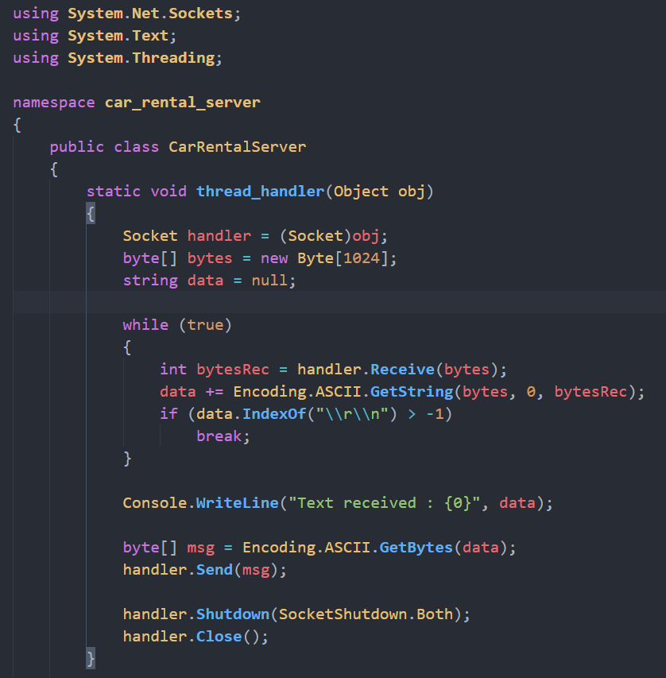
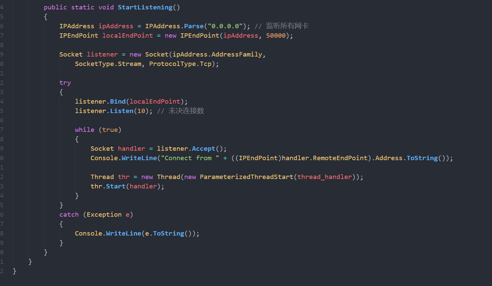
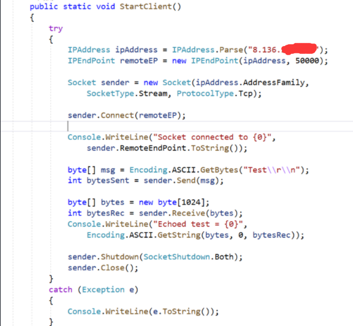
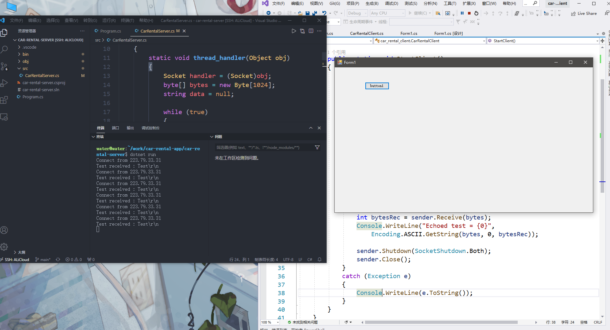
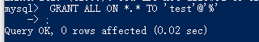

# car-rental-app

## INDEX

[- 项目简介](#项目简介)  
[- 项目组成](#项目组成)  
[- 使用演示](#使用演示)  
[- 实现代码](#实现代码)  
[- 推荐文献](#推荐文献)  
[- Timeline](#Timeline)

---

### 项目简介

这是 c#的课设作业，c#+winform 写个 windows 下的客户端，服务器 c# socket 编程在 linux 的 ECS 上跑再连个数据库，写出一个真的能用的 demo。  
该项目目的在于完成课设任务和尝试下第一次写一个 app.

---

### 项目组成

典型的 C/S 架构，cilent 和 server 文件夹如名称一样分别是客户端和服务器端。
至于为什么选择 c#作为服务器开发语言呢，因为这是 c#课设:-)

**1. 客户端：**  
使用 c#和 WinForm 实现 windows 平台下的客户端，不考虑客户端跨平台,使用 VS。

- windows 下的 WinForm 实现客户端编程
- 流式 socket 编程与服务器通信
- OOP 编程技术

**2. 服务端：**  
使用 c#和 MySql，运行在 linux(Ubuntu 20.04)平台，拥有公网 IP 可在公网使用，使用 VScode.

- 多线程实现服务端的并发服务，由于个人并不熟悉 c#，所以服务器实现的非常简单，如果要更一步提升可以使用线程池、IO 多路复用等技术。
- 使用同步 IPC 来保证正确性，使用了信号量和互斥锁。
- 使用流式 socket 进行简单的网络编程，因为不熟悉 c#所以没有直接使用网络库，更推荐使用现有网络库。
- 连接 MySql 数据库编程

**3. 通信协议：**  
由于这是一个非周知服务，没有对应端口，RFC 上没有对应的应用层协议，不过显然这个 app 也用不到什么多复杂的协议，简单几个指令传过去就好了。。

1. **[ ]** 代表可选参数，不同字段以空格分隔，**\r\n** 作为分隔字节流的边界
1. 登录请求：**ACCOUNT TYPE \[account\] \[password\] \r\n**
   - TYPE 是登录类型，指游客(VISITOR)、用户(USER)、管理员(ADMINISTRATOR)
   - account 和 password 是具体账号密码，可选项(非游客才需要)
<!-- 1. REGISTER to do -->
1. 各种各样的响应：**RESPONSE \r\n**
   - 登录响应:
     - LOGIN_SUCCESS(登录成功)
     - ACCOUNT_NOT_FOUND(登陆失败无该账号)
     - PASSWORD_WRONG(登录失败密码错误)
   - 通用响应:
     - OTHER_WRONG(其他错误如网络或服务器的错误)
   <!-- to do to do to do to do to do to do -->

---

### 使用演示

1. 服务器上[安装.NET环境](https://docs.microsoft.com/zh-cn/dotnet/core/install/),注意 .NET 在 2014 后开始跨平台移植了支持 linux，所以不用再需要 Mono 这个第三方提供环境了（当然 .NET 并没有那么强大，比如 Unity 不接受.NET5 因为里面有 bug 和没有实现的东西，用的就是 Mono）。
1. 服务器上安装MySQL并运行MySQL服务。  
    
1. 服务器后台运行服务端程序(推荐成为一个守护进程，不过这里我至少单纯后台运行)。  
    
1. 客户可以在windows环境下运行客户端程序(这里客户端没有跨平台，现在只支持windows)，然后通过程序窗体进行操作。  
    

---

### 实现代码

1. 首先第一步肯定是建一个 repo，写一些计划文档之类的东西，自然用的是 github + git，文档使用的是 markdown 格式，另外特别 vscode 的所见即所得和 markdown 纠错插件舒服了。
   

1. 然后实现了一种非常简单的多线程 server demo，完成这部分功能，以后进行代码填空就行。

   - 给 ECS 开个测试安全组  
       
   - 这是 server 的 demo 截图  
       
       
   - 这是 client 的 demo 截图  
       
   - demo 测试截图  
       

1. 因为这个课设并不需要多大的并行服务量，所以我并没有实现线程池，也懒得用 c#的并行库的线程池。遇到的第一个难题是怎么确定线程的数量，如果是**CPU 密集型那么自然套 CPU 核心数 + 1**即可，**I/O 密集的程序，CPU 核心数 \* [1 + (IO/CPU)]**，但这个服务是一个交互式程序，阻塞占比估计 9 成以上，既不是一个 CPU 密集型也不是一个 IO 密集型，所以可以用这个**线程数 = Ncpu /（1 - 阻塞系数）**，租的阿里云 ECS 是 2CPU 4 核心的，阻塞系数算 0.9 么估算是 40，这里我用的是 Semaphore 控制线程资源。

1. 遇到了一个小问题就是一直跟我讲 Address already used 错误，我一开始以为是 TIME_WAIT 的地址重用问题，等待就好，然后发现不是(原理上也不是。。)，用 netstat 看了看进程发现上次运行的服务就没关。。

1. 使用NuGet给linux下引入MySql.Data包，才可以using MySql.Data.MySqlClient。

    ```c#
    // 可见sln里面显示了这个引用
    <PackageReference Include="MySql.Data" Version="8.0.26"/>
    ```

1. 新建一个mysql用户发现看不到数据库，这是因为忘了授权了。  


---

### 推荐文献

[1] _.NET Docs_ <https://docs.microsoft.com/zh-cn/dotnet/>  
[2] _MySql .NET develop docs_ <https://dev.mysql.com/doc/connector-net/en/>
[3] _Unix Network Programming, Volume 1: The Sockets Networking API_

---

### Timeline

- [x] repo README 编写
- [x] windows 上 vs 建立 winform 项目
- [x] 安装.net,linux 上 vscode 建立控制台项目
- [x] 熟悉 c# socket 库
- [x] 通信 demo
- [x] 了解 c# 多线程库和同步 IPC
- [x] 服务器多线程 demo
- [x] 使用 ECS 而非 WSL 测试
- [x] 讨论组内分工
- [x] 数据库熟悉使用
- [ ] 服务器配置mysql
- [ ] 登录功能实现
- [ ] 数据库设计
- [ ] 数据库实现
- [ ] 实现应用层协议
- [ ] 主要功能实现
- [ ] car rental app demo 完成
- [ ] 测试
- [ ] 发布
- [ ] 文档编写
- [ ] ppt、实验报告完成
- [ ] 课设答辩
