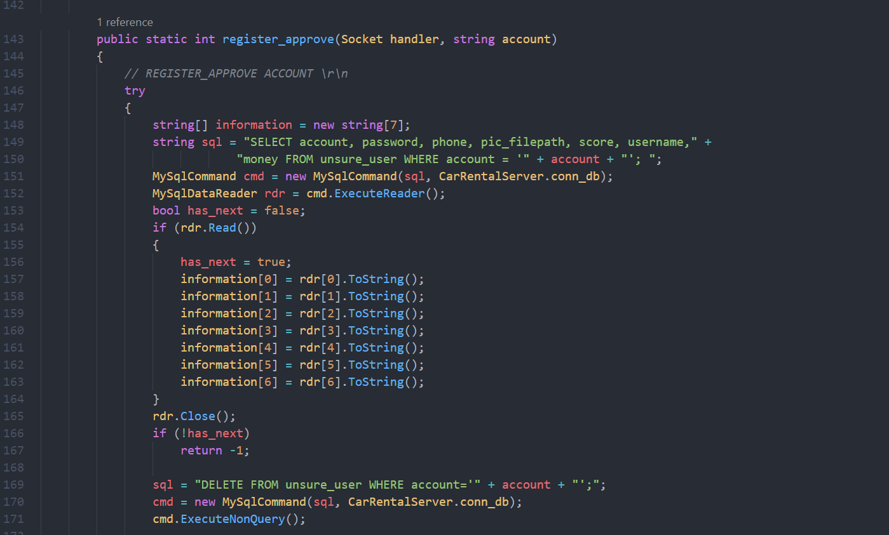
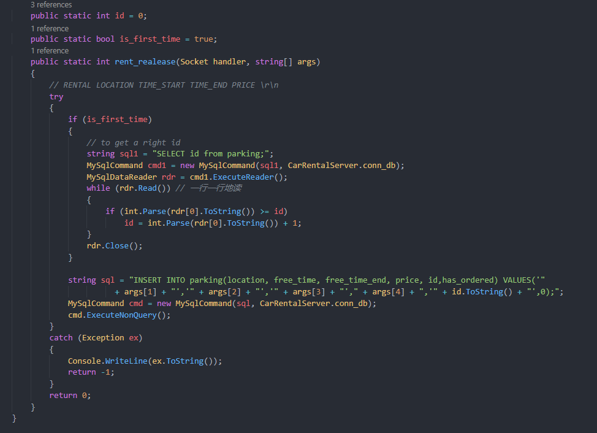
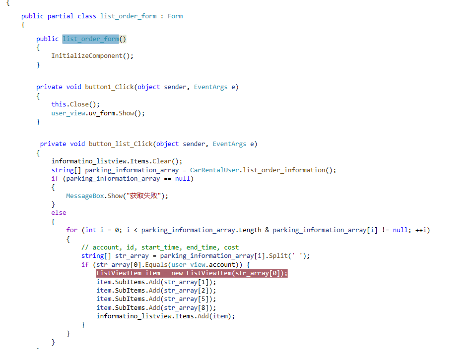

# car-rental-app

## INDEX

[- 项目简介](#项目简介)  
[- 项目组成](#项目组成)  
[- 使用演示](#使用演示)  
[- 实现代码](#实现代码)  
[- 推荐文献](#推荐文献)  
[- Timeline](#Timeline)

---

### 项目简介

这是 c#的课设作业，c#+winform 实现 windows 下的客户端，服务端由 c# TCPsocket + 多线程编程实现，在我的阿里云ECS(云服务器)上运行服务端代码和MySQL数据库，通过典型的C/S架构实现这个app demo。该项目目的在于完成课设任务和尝试下第一次写一个 app.  
客户端运行环境支持winform和.NET即可，windows7、10等都是可以的；服务端运行在支持.NET的任何平台都行，我自然选择linux，当然基本上什么平台只要支持.NET都能跑，无所谓；数据库同样跑在ECS上，至于为什么选择MySQL，是因为我真的一点都不了解.NET技术栈，我不知道我应该用sqlServer会非常方便。。。  

---

### 项目组成

典型的 C/S 架构，cilent 和 server 文件夹如名称一样分别是客户端和服务器端。
至于为什么选择 c#作为服务器开发语言呢，因为这是 c#课设:-), 说实话拿c#写服务端代码我真是失了智。。。

**1. 客户端：**  
使用 c#和 WinForm 实现 windows 平台下的客户端，不考虑客户端跨平台,使用 VS。

- windows 下的 WinForm 实现客户端窗体
- 流式 socket 编程与服务器通信
- OOP 编程技术

**2. 服务端：**  
使用 c#和 MySql，运行在 linux(Ubuntu 20.04)平台，拥有公网 IP 可在公网使用，使用 VScode.

- 多线程实现服务端的并发服务，由于个人并不熟悉 c#，所以服务器实现的非常简单，如果要更一步提升可以使用线程池、IO 多路复用或者直接用给的或者第三方的网络库等。
- 使用同步 IPC 来保证正确性，使用了信号量和互斥锁。
- 使用流式 socket 网络编程，因为不熟悉 c#所以没有直接使用网络库，实际中当然要使用现有网络库而不是自己造轮子。
- 连接 MySql 数据库编程。

**3. 通信协议：**  
由于这是一个非周知服务，没有对应端口，RFC 上没有对应的应用层协议，不过显然这个 app 也用不到什么多复杂的协议，所以我们自己写了一个应用层协议的一部分。

1. **[ ]** 代表可选参数，不同字段以空格分隔，**\r\n** 作为分隔字节流的边界
1. 通用响应: **没有明确表明响应的就是通过通用响应报文格式回应**
     - **SUCCESS \r\n**
     - **OTHER_WRONG \r\n**(其他错误如网络或服务器的错误)
1. 登录请求：**ACCOUNT TYPE \[account\] \[password\] \r\n**
   - TYPE 是登录类型，指游客(VISITOR)、用户(USER)、管理员(ADMINISTRATOR)
   - account 和 password 是具体账号密码，可选项(非游客才需要)
   - 登录响应:
     - LOGIN_SUCCESS(登录成功)
     - ACCOUNT_NOT_FOUND(登陆失败无该账号)
     - PASSWORD_WRONG(登录失败密码错误)
1. 注册请求：
   - **REGISTER ACCOUNT PASSWORD USERNAME PHONE \r\n**
   - **等待服务器发回一个"SUCCESS \r\n"的响应**
   - **发送图片大小 \r\n**
   - **等待服务器发回一个"SUCCESS \r\n"的响应**
   - **发送图片二进制字节流 \r\n**
   - 注册响应:
     - REGISTER_SUCCESS(注册请求发送成功(待审批))
   - 失败或错误响应:
     - **OTHER_WRONG \r\n**
1. 列出车位信息请求：
   - **LIST \r\n**
   - 列出车位信息响应:
     - 首先是一直发回**对应的信息以|分隔不同消息** (这个用|分隔,而没有\r\n)
     - 最后说明结束**LIST_END \r\n**
1. 搜索车位请求：
   - **SEARCH LOCATION TIME_START DAYS PRICE \r\n**（没有就是NULL）
   - 成功响应:
     - **SUCCESS \r\n**
   - 失败或错误响应:
     - **OTHER_WRONG \r\n**
1. 出租车位请求：
   - **RENTAL LOCATION TIME_START TIME_END PRICE \r\n**
   - 成功响应:
     - **SUCCESS \r\n**
   - 失败或错误响应:
     - **OTHER_WRONG \r\n**
1. 订车位请求:
   - **ORDER ACCOUNT ID TIME_START DAYS \r\n**
   - 订单响应:
     - ID或日期错误**ID_OR_DATE_WRONG \r\n**
     - 余额不足**MONEY_WRONG \r\n**
     - 已经被订**HAS_ORDERED_WRONG \r\n**
1. 列出用户信息请求：
   - **LIST_USER \r\n**
   - 列出用户信息响应:
     - 首先是一直发回**对应的信息以|分隔不同消息** (这个用|分隔,而没有\r\n)
     - 最后说明结束**LIST_USER_END \r\n**
1. 充值用户请求：
   - **CHARGE_MONEY ACCOUNT VALUE \r\n**
   - 成功响应:
     - **SUCCESS \r\n**
   - 失败或错误响应:
     - **OTHER_WRONG \r\n**
1. 查询用户信息请求:
   - **GET_USER ACCOUNT \r\n**
   - 查询用户信息响应:
     - 成功**USER_INFORMATION ACCOUNT USERNAME SCORE MONEY \r\n**
   - 失败或错误响应:
     - **OTHER_WRONG \r\n**
1. 列出订单请求：
   - **LIST_ORDER \r\n**
   - 列出订单信息响应:
     - 首先是一直发回**对应的信息以|分隔不同消息** (这个用|分隔,而没有\r\n)
     - 最后说明结束**LIST_ORDER_END \r\n**
1. 管理员踢出用户：
   - **BAN_USER ACCOUNT \r\n**
   - 成功响应:
     - **SUCCESS \r\n**
   - 失败或错误响应:
     - **OTHER_WRONG \r\n**
1. 管理员删除车位信息：
   - **BAN_PARKING ID \r\n**
   - 成功响应:
     - **SUCCESS \r\n**
   - 失败或错误响应:
     - **OTHER_WRONG \r\n**
1. 管理员删除车位信息：
   - **BAN_ORDER ACCOUNT ID \r\n**
   - 成功响应:
     - **SUCCESS \r\n**
   - 失败或错误响应:
     - **OTHER_WRONG \r\n**
1. 管理员发布公告请求
   - **ANNOUNCE \r\n**
   - **等待服务器发回一个"SUCCESS \r\n"的响应**
   - **传数据(textBox的行也是\r\n)**
   - **ANNOUNCE_END \r\n**
   - 成功响应:
     - **SUCCESS \r\n**
   - 失败或错误响应:
     - **OTHER_WRONG \r\n**
1. 用户获取公告请求：
   - **GET_ANNOUNCE \r\n**
   - 成功响应:
     - **SUCCESS \r\n**
   - 失败或错误响应:
     - **OTHER_WRONG \r\n**
1. 用户获取留言请求：
   - **GET_USER_MESSAGE ACCOUNT \r\n**
   - 成功响应:
     - **SUCCESS \r\n**
   - 失败或错误响应:
     - **OTHER_WRONG \r\n**
1. 管理员留言给用户请求：
   - **PUT_MESSAGE_TO_USER ACCOUNT \r\n**
   - **等待服务器发回一个"SUCCESS \r\n"的响应**
   - **传数据(textBox的行也是\r\n)**
   - **MESSAGE_END \r\n**
   - 成功响应:
     - **SUCCESS \r\n**
   - 失败或错误响应:
     - **OTHER_WRONG \r\n**
1. 用户留言给管理员请求：
   - **PUT_MESSAGE_TO_ADMIN ACCOUNT \r\n**
   - **等待服务器发回一个"SUCCESS \r\n"的响应**
   - **传数据(textBox的行也是\r\n)**
   - **MESSAGE_END \r\n**
   - 成功响应:
     - **SUCCESS \r\n**
   - 失败或错误响应:
     - **OTHER_WRONG \r\n**
1. 管理员获取留言请求：
   - **GET_ADMIN_MESSAGE \r\n**
   - 成功响应:
     - **SUCCESS \r\n**
   - 失败或错误响应:
     - **OTHER_WRONG \r\n**
1. 管理员获取一个待审批用户请求：
   - **GET_UNSURE_USER \r\n**
   - 无待审批用户响应:
     - **EMPTY \r\n**
   - 成功响应:
     - **RESPONSE ACCOUNT USERNAME PHONE \r\n**
     - **等待客户端发回一个"SUCCESS \r\n"的响应**
     - **发送图片大小 \r\n**
     - **等待客户端发回一个"SUCCESS \r\n"的响应**
     - **发送图片二进制字节流 \r\n**
   - 失败或错误响应:
     - **OTHER_WRONG \r\n**
1. 管理员审批通过请求：
   - **REGISTER_APPROVE ACCOUNT \r\n**
   - 成功响应:
     - **SUCCESS \r\n**
   - 失败或错误响应:
     - **OTHER_WRONG \r\n**
1. 管理员审批不通过请求：
   - **REGISTER_FAIL ACCOUNT \r\n**
   - 成功响应:
     - **SUCCESS \r\n**
   - 失败或错误响应:
     - **OTHER_WRONG \r\n**

---

### 使用演示

1. 服务器上[安装.NET 环境](https://docs.microsoft.com/zh-cn/dotnet/core/install/),注意 .NET 在 2014 后开始跨平台移植了支持 linux，所以不用再需要 Mono 这个第三方提供环境了（当然 .NET 并没有那么强大，比如 Unity 不接受.NET5 因为里面有 bug 和没有实现的东西，用的就是 Mono）。
1. 服务器上安装 MySQL 并运行 MySQL 服务。  
   
1. 服务器后台运行服务端程序(推荐成为一个守护进程，不过这里我只是单纯后台运行)。  
1. 客户可以在 windows 环境下运行客户端程序(这里客户端没有跨平台，现在只支持 windows系列)，然后通过程序窗体进行操作。  

---

### 实现代码

1. 首先第一步肯定是建一个 repo，写一些计划文档之类的东西，自然用的是 github + git，文档使用的是 markdown 格式，另外特别 vscode 的所见即所得和 markdown 纠错插件非常舒服。
   

1. 然后实现了一种非常简单的多线程 server demo，完成这部分功能，以后进行代码填空就行。

   - 给 ECS 开个测试安全组  
     
   - 这是 server 的 demo 截图  
       
     
   - 这是 client 的 demo 截图  
     
   - demo 测试截图  
     

1. 因为这个课设并不需要多大的并行服务量，所以我并没有实现线程池，也懒得用 c#的并行库的线程池。遇到的第一个难题是怎么确定线程的数量，如果是**CPU 密集型那么自然套 CPU 核心数 + 1**即可，**I/O 密集的程序，CPU 核心数 \* [1 + (IO/CPU)]**，但这个服务是一个交互式程序，阻塞占比估计显然这个非常低，因为客户端想出来自己要干什么按一下按钮一般都是几秒以上，而服务器处理消息并不需要多大性能，都不是一个数量级的，既不是一个 CPU 密集型也不是一个 IO 密集型，而是一个交互阻塞型程序，所以可以用这个**线程数 = Ncpu /（1 - 阻塞系数）**来估算.  
      
这是一个比较有代表的耗时算是中等偏上的功能的用时(当然挺不准的，因为我只是从代码的角度考虑，没有实际一个一个把每个功能的耗时都试一次)，估一个差不多的值，2次30多秒，低估(为了提高响应度)阻塞比为0.96估算,租的阿里云 ECS 是 2CPU 4 核心的，阻塞系数算 0.96 么估算是 100，这里我用的是 Semaphore 控制线程资源。  
**注意这里是非常简单的估算，实际中会经过繁复的性能测试，和不同规模数据的性能测试，计算公式也比这个复杂多了，这里只是随意估算一个意思一下而已,而且这里网络延迟造成的阻塞时间也没考虑(我服务器在杭州，我人在青岛，我觉得网络挺好的，我组员就有说ssh过去好卡的。。。)**

1. 遇到了一个小问题就是一直跟我讲 Address already used 错误，我一开始以为是 TIME_WAIT 的地址重用问题，等待就好，然后发现不是(原理上也不是。。)，用 netstat 看了看进程发现上次运行的服务就没关。。

1. 使用 NuGet 给 linux 下引入 MySql.Data 包，才可以 using MySql.Data.MySqlClient。

   ```c#
   // 可见sln里面显示了这个引用
   <PackageReference Include="MySql.Data" Version="8.0.26"/>
   ```

1. NuGET在服务器上死活告诉我无法建立连接，一开始我以为我的ECS上不了外网所以连不上，所以找了个华为的镜像源；但还是不行，然后仔细看错误代码，发现是安全证书的问题，我首先检查了openssl，发现没有问题，让我陷入困惑，然后我看了/usr/local/ssl/certs发现里面是空的，相反我在/etc/ssl/certs有证书内容，所以我删了certs然后ln -s建立了个软链接到etc下的那个，然后就成功了，nuget终于能正常给我引入mysql.data包了。(Ubuntu真坑。。)

1. 新建一个 mysql 用户发现看不到数据库，这是因为忘了授权了。  
   

1. 配置数据库:  
     
     
     
   

1. 测试远程使用数据库(数据库已放到 ECS 上了)  
   

1. 实现登录功能，用户从客户端窗体点击,然后内部代码实现发送登录报文到服务器，服务器解析请求，发现是登录请求然后查询数据库，对比数据库数据看是否有此用户，服务器返回客户端登录结果，客户端解析登陆结果，然后客户端窗体显示结果。
   - **客户端**  
     
     
     
     
   - **窗体**  
   
   - **服务端**  
     
     
   **注意这里是测试，所以用的是回环地址 127.0.0.1，后面实际项目是用公网 IP 的(这里是因为 wsl 比 ssh 舒适，等着项目完成后再放到 ECS 上)**  
   

1. 实现应用层协议，来规定好报文格式和一些tcp传输的细节，这里我遇到一些传二进制文件的问题，修改了一下报文格式和传输细节，终于成功。

1. 实现注册
   - **客户端**  
     
     
     
     
     
     
     
   - **窗体**  
     
     
   - **服务端**  
     
     
     
     
     
     

1. 实现浏览车位功能  
     
     
   

1. 实现查询功能
   - **客户端**  
     
     
   - **窗体**  
     
   - **服务端**  
     
     

1. 实现发布功能
   - **客户端**  
     
   - **窗体**  
     
   - **服务端**  
     

1. 实现预约功能
   - **客户端**  
     
   - **窗体**  
     
   - **服务端**  
     
     

1. 实现个人中心
   - **客户端**  
     
     
   - **窗体**  
     
   - **服务端**  
     

1. 实现我的订单
   - **客户端**  
     
   - **窗体**  
     
   - **服务端**  
     

1. 实现留言和留言管理
   - **客户端**  
     
     
   - **窗体**  
     
     
   - **服务端**  
     
     

1. 实现车位管理
   - **客户端**  
     
     
   - **窗体**  
     
   - **服务端**  
     

1. 实现订单管理
   - **客户端**  
     
     
   - **窗体**  
     
   - **服务端**  
     

1. 实现用户管理
   - **客户端**  
     
     
   - **窗体**  
     
   - **服务端**  
     

1. 实现公告
   - **窗体**  
     
     
   - **服务端**  
     
     

1. 实现各种各样的功能，不过具体都是C/S架构思路，用户点击客户端窗体对应控件，让客户端发送请求到服务器，服务器解析请求并执行相应命令，如果需要数据库那么服务器会操作数据库取得结果，然后服务器发回客户端响应报文，然后客户端解析响应报文，并最终显示到客户端窗体上。

---

### 推荐文献

[1] _.NET Docs_ <https://docs.microsoft.com/zh-cn/dotnet/>  
[2] _MySql .NET develop docs_ <https://dev.mysql.com/doc/connector-net/en/>  
[3] _Unix Network Programming, Volume 1: The Sockets Networking API_  
[4] _TCP/IP Illustrated, Vol. 1: The Protocols_  
[5] _The Linux Programing Interface_  
[6] _Computer Networking: A Top-down Approach_  
[7] _Computer Systems: A Programmer's Perspective_  
[8] _Operating System Concepts_  

---

### Timeline

- [x] repo README 编写
- [x] windows 上 vs 建立 winform 项目
- [x] 安装.net,linux 上 vscode 建立控制台项目
- [x] 熟悉 c# socket 库
- [x] 通信 demo
- [x] 了解 c# 多线程库和同步 IPC
- [x] 服务器多线程 demo
- [x] 使用 ECS 而非 WSL 测试
- [x] 讨论组内分工
- [x] 数据库熟悉使用
- [x] 服务器配置 mysql
- [x] 登录功能实现
- [x] 数据库设计
- [x] 实现应用层协议
- [x] 注册功能
- [x] 浏览车位功能
- [x] 查询功能
- [x] 发布功能
- [x] 预约功能
- [x] 个人中心
- [x] 我的订单
- [x] 留言和留言管理
- [x] 车位管理
- [x] 订单管理
- [x] 用户管理
- [x] 公告
- [x] 测试
- [x] 文档和ppt
